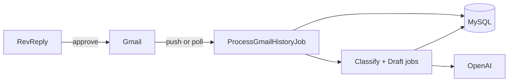

# RevReply

Connect Gmail, classify inbound mail, generate reply drafts, approve before send.

Repo: `gmail-auto-responder` · Laravel 11 + Next.js 14 · local test uses SQLite (no Docker)

---

## 1. Overview

Multi-user app. Each person connects one or more Gmail inboxes. Incoming mail gets classified and drafted by AI. Nothing sends until you approve it.

**Flow**

1. Register and sign in
2. Connect Gmail (one Google OAuth app for the whole product; multiple mailboxes per user)
3. New mail syncs into the DB
4. Backend classifies it and pulls out keywords
5. LLM writes a draft from your reply prompt
6. You open the thread, edit if needed, then **Approve & send** or **Reject**

Labels: `interested`, `meeting_request`, `not_interested`, `unclear`. Custom reply prompt per user. Draft saved in DB and Gmail when the API allows. Each user only sees their own mail.

---

## 2. What works

Tested on localhost.

### UI

| Area | What it does |
|------|----------------|
| **Overview** | Account count, mail processed, replies sent, drafts waiting. Connected inboxes and recent activity. |
| **Conversations** | Thread list with pages. Filter by status (all / needs review / sent) or inbox. Ctrl+K search. Each row shows sender, subject, and which Gmail received it. |
| **Thread detail** | Message and labels on the left, draft on the right. Edit, approve & send, or reject. Status while classify/draft runs. |
| **Mailboxes** | Connect / disconnect Gmail. Sync one inbox or all. Status and message count per account. |
| **Notifications** | Header bell — draft ready, reply sent. Badge count. Mark all read. |
| **Read / unread** | ✕ not seen, ✓ seen. Toggle in the list; opening a thread marks it read. |
| **Settings** | Edit reply prompt. See LLM model in use. |
| **Help** | Steps to connect Gmail and add another mailbox. |

### Backend

- Register / login (Sanctum bearer token)
- Gmail OAuth, multiple mailboxes per user
- Pub/Sub webhook or scheduler poll — same pipeline either way
- Queues: `gmail-sync`, `ai`
- OpenAI classify + draft (`gpt-4o-mini` default); keyword stub if API fails
- Thread search, filters, pagination, notifications (unread only)
- Idempotent sync, token refresh lock, watch renewal cron

**Local test:** SQLite + sync queue — no Docker, no Redis, no queue worker window. Scheduler polls Gmail every minute; Mailboxes page also syncs in the background.

---

## 3. Run locally (client test on Windows)

**Need:** PHP 8.2+ (extensions: `pdo_sqlite`, `mbstring`, `openssl`), Composer, Node 18+.

**Do not need:** Docker, MySQL, Redis, any existing database file, `manual_add_notification_state.sql`, or `fix-migration-encoding.php`.

The app creates a **new** SQLite database at `backend/database/database.sqlite` on first setup. Your client starts fresh — no old DB to import.

### One-time setup

```cmd
scripts\local\setup.bat
```

Then edit `backend\.env` and set:

```env
GOOGLE_CLIENT_ID=...
GOOGLE_CLIENT_SECRET=...
OPENAI_API_KEY=sk-...
```

### Google OAuth

1. [Google Cloud Console](https://console.cloud.google.com) → enable **Gmail API**
2. OAuth consent screen → External → add the Gmail address as a **test user** (Testing mode)
3. Scopes: `gmail.readonly`, `gmail.compose`, `gmail.modify`
4. Credentials → OAuth client ID → Web application
5. Redirect URI: `http://localhost:8000/api/gmail/callback`
6. Copy Client ID + secret into `backend\.env`

Pub/Sub is **not** required locally — the scheduler polls Gmail every minute.

### Start the app (3 CMD windows)

```cmd
scripts\local\start.bat
```

| Window | What it does |
|--------|----------------|
| API | `http://localhost:8000` — login, OAuth, API |
| Scheduler | Polls Gmail every minute |
| Frontend | `http://localhost:3000` — UI |

`QUEUE_CONNECTION=sync` in `.env.example` means jobs run immediately — **no separate queue worker window**.

You can also click **Sync now** on Mailboxes if you skip the scheduler, but keeping the scheduler open is recommended.

### Smoke test

1. Open http://localhost:3000 → Register
2. Mailboxes → Connect Gmail
3. Email yourself from another account
4. Wait ~60s or click **Sync now**
5. Conversations → approve draft

If stuck: check all 3 windows are still running → OAuth test user in GCP → `backend\storage\logs\laravel.log`

### Manual setup (optional)

```cmd
cd backend
copy .env.example .env
composer install
php artisan key:generate
type nul > database\database.sqlite
php artisan migrate
cd ..\frontend
copy .env.local.example .env.local
npm install
```

Run in separate terminals: `php artisan serve`, `php artisan schedule:work`, `npm run dev` (in `frontend`).

---

## 4. How it works

### Tables

```
users                   reply_prompt
gmail_accounts          tokens, history cursor, watch expiry, status
gmail_threads           subject, snippet, notification_state (0 unread / 1 read)
gmail_messages          body, sender, received_at
classifications         label, keywords, confidence
draft_replies           body, status
processed_notifications Pub/Sub dedup (not in UI)
```

`users` → `gmail_accounts` → `gmail_threads` → `gmail_messages`. One classification + one draft per inbound message. Scoped by `user_id`.

### Flow



### Push vs poll

- **Prod:** Pub/Sub set → watch on connect → Gmail POSTs `/api/webhooks/gmail/pubsub` → job queued
- **Local:** no Pub/Sub → `gmail:poll` every minute + UI sync on Mailboxes

Same tables and jobs. Different trigger.

### Queues

Local `.env.example` uses `QUEUE_CONNECTION=sync` (jobs run immediately — no worker process).

Production uses Redis queues:

```bash
php artisan queue:work redis --queue=gmail-sync,ai
```

- `gmail-sync` — fetch mail
- `ai` — classify + draft

Sync: 5 retries. AI: 3 retries. Failures → `failed_jobs`.

**Commands:** `gmail:poll` · `gmail:renew-watches` · `gmail:process-pending` · `gmail:backfill-drafts`

### When things break

Duplicate webhook → skip. Token revoked → reconnect on Mailboxes. History ID expired → mailbox error. Gmail draft API fails → draft still in DB. OpenAI fails → stub, pipeline continues.

`GET /up` · logs in `backend/storage/logs/laravel.log`

---

## 5. Upgrade plan (published version)

Same foundation in prod: one OAuth app, multi-mailbox, queues, human approval before every send. What changes is ingress, ops, and polish.

### Now vs later

| Area | This repo | Published |
|------|-----------|-----------|
| Mail ingress | Poll + optional Pub/Sub | Pub/Sub only, no browser sync |
| Webhook | Payload check | JWT on every request |
| API | Sanctum | + rate limits |
| Ops | log file, `/up`, `failed_jobs` | Horizon, Sentry, trace IDs, alerts |
| OAuth | Testing mode | Published app, any user |
| Secrets | `.env` | Secrets manager |
| Workers | 3 CMD windows (local) | Supervisor/systemd, auto-restart |
| Notifications | In-app bell | + email for reconnect, draft ready |
| Audit | Draft status in DB | Full log of who approved/edited/rejected |

### Production work

- Webhook acks fast, all Gmail/LLM work in workers
- Separate worker pools for sync vs AI; scale on queue depth
- Per-mailbox rate limit + sync lock (one OAuth app = shared Google quota)
- Auto-resync when history ID expires; circuit-break bad mailboxes
- Remove `sync-all` polling from frontend in prod
- Onboarding flow, reconnect banners, optional mailbox nicknames
- Load test: ~100 concurrent webhooks, no duplicate drafts

### Launch checklist

- [ ] Google OAuth published (not Testing)
- [ ] Pub/Sub push + JWT on production URL
- [ ] Secrets manager, not plain `.env` on servers
- [ ] Workers + scheduler auto-restart (production)

---

Copy `.env.example` files, run `scripts\local\setup.bat` then `scripts\local\start.bat`, connect Gmail, open Conversations.
