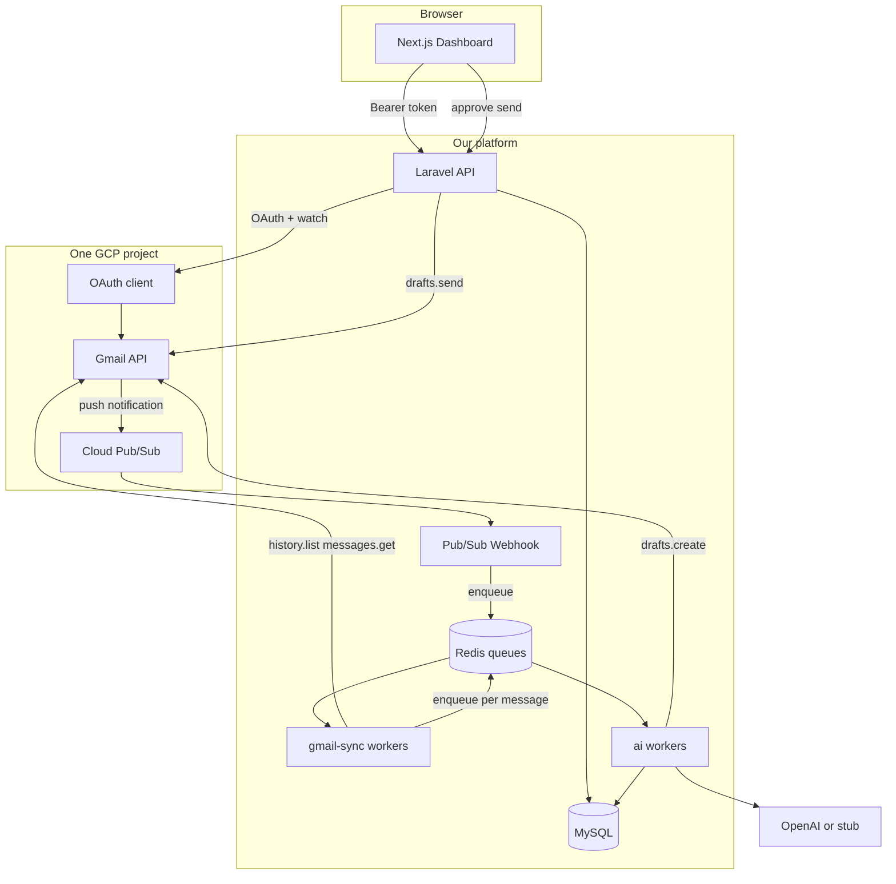
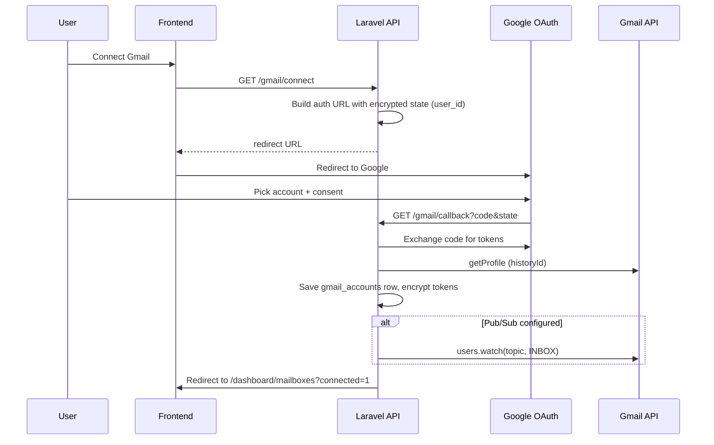

# Gmail Auto-Responder

Take-home project: a multi-user SaaS that connects Gmail accounts, classifies inbound mail, generates reply drafts with an LLM, and lets the user approve before anything is sent.

**One-line pitch:** register → connect Gmail → new mail gets classified and drafted → you edit → approve & send (or reject). No auto-send.

---

## What works today

This is a working MVP, not a finished product. You can run it locally and walk through the full loop.

| Area | Status |
|------|--------|
| User auth (register / login) | Works — Laravel Sanctum bearer tokens |
| Connect one or more Gmail accounts | Works — same Google OAuth app for everyone |
| Sync new inbound mail | Works — Pub/Sub push **or** polling fallback (see below) |
| Classify email + extract keywords | Works — stub (keyword rules) or OpenAI |
| Generate draft using user's reply prompt | Works — saved to DB + Gmail `drafts.create` when possible |
| Review / edit / approve & send / reject | Works — human-in-the-loop only |
| Per-user reply prompt | Works — Dashboard → Settings tab |
| Multi-tenant isolation | Works — all data scoped by `user_id` |

**What I tested end-to-end:** register, connect Gmail, send myself a test email with words like "meeting" or "interested", wait for sync + queue worker, see thread + classification + draft in the UI, approve and confirm it lands in Gmail sent mail.

**Local dev caveat:** most people run **without** a public Pub/Sub URL. In that case the app falls back to **polling** (scheduler + optional UI sync). Production design assumes push; local setup assumes poll. Same connect flow either way.

---

## Repo layout

```
gmail-auto-responder/
├── backend/              Laravel 11 API
├── frontend/             Next.js 14 (App Router, TypeScript)
├── docker-compose.yml    MySQL 8 + Redis 7
├── install.ps1           First-time setup (Windows)
├── run-backend.bat       migrate + scheduler + API
├── run-queue.bat         Redis queue worker
├── run-frontend.bat      Next.js dev server
└── README.md             ← start here
```

Env files (copy from examples before first run):

- `backend/.env.example` → `backend/.env`
- `frontend/.env.local.example` → `frontend/.env.local`

---

## How to run locally

### Prerequisites

- PHP 8.2+ and Composer (or use bundled `backend/composer.phar`)
- Node.js 18+
- Docker Desktop (MySQL + Redis)

### 1. Infrastructure

```bash
docker compose up -d
```

MySQL listens on `3306`, Redis on `6379`. Credentials match `backend/.env.example`.

### 2. Install dependencies

**Windows (easiest):**

```powershell
.\install.ps1
```

**Manual:**

```bash
cd backend && cp .env.example .env && php composer.phar install && php artisan key:generate
cd ../frontend && cp .env.local.example .env.local && npm install
```

### 3. Database

```bash
cd backend
php artisan migrate
```

### 4. Google Cloud (minimum for OAuth)

You need **one** GCP project with:

1. **Gmail API** enabled
2. **OAuth consent screen** — Testing mode is fine for localhost; add your Gmail as a test user
3. **OAuth 2.0 Web client** — redirect URI: `http://localhost:8000/api/gmail/callback`
4. Put `GOOGLE_CLIENT_ID` and `GOOGLE_CLIENT_SECRET` in `backend/.env`

Pub/Sub is optional for local dev. Without it, polling handles sync. See [Google OAuth: dev vs production](docs/GOOGLE_OAUTH_DEV_VS_PRODUCTION.md).

**Optional — Pub/Sub (push mode):**

1. Enable Cloud Pub/Sub, create topic `gmail-push`
2. Grant `gmail-api-push@system.gserviceaccount.com` the **Pub/Sub Publisher** role on that topic
3. Push subscription URL → your public webhook, e.g. `https://<tunnel>/api/webhooks/gmail/pubsub`
4. Set `GOOGLE_PUBSUB_TOPIC=projects/<project>/topics/gmail-push` in `backend/.env`
5. Use ngrok or Cloudflare Tunnel so Google can reach your machine

### 5. LLM (optional)

Default is stub mode (no API key needed):

```env
LLM_DRIVER=stub
```

For real drafts:

```env
LLM_DRIVER=openai
OPENAI_API_KEY=sk-...
OPENAI_MODEL=gpt-4o-mini
```

If OpenAI fails, the backend falls back to stub so the pipeline doesn't hard-stop.

### 6. Start the app

Open **three** terminals (or use the `.bat` scripts on Windows):

```bash
# Terminal 1 — API + scheduler (polls every minute when Pub/Sub is off)
run-backend.bat
# or: cd backend && php artisan serve
#     plus: php artisan schedule:work

# Terminal 2 — queue worker (required for classify + draft jobs)
run-queue.bat
# or: cd backend && php artisan queue:work redis --queue=gmail-sync,ai

# Terminal 3 — frontend
run-frontend.bat
# or: cd frontend && npm run dev
```

Open **http://localhost:3000**, register, go to **Mailboxes → Connect Gmail**, send a test email to that inbox, then check **Threads**.

### Quick smoke test

1. Register / log in
2. Connect Gmail (Google account picker)
3. Send yourself: *"I'm interested in a demo, can we meet Tuesday at 2pm?"*
4. Confirm queue worker is running
5. Open **Threads** — you should see classification (`interested` or `meeting_request`) and a pending draft
6. Open the thread → edit draft → **Approve & send**
7. Check Gmail sent folder

---

## Architecture

High level: the browser talks only to our API. The API never blocks on Gmail or LLM. Heavy work goes through Redis queues.



**Design choice I stand behind:** one Google OAuth application for the whole product. I would not create a GCP project or OAuth client per customer. Each connected mailbox is a row in `gmail_accounts` with its own tokens, history cursor, and processing state.

More detail: [docs/PRODUCTION_SCALE.md](docs/PRODUCTION_SCALE.md)

---

## Gmail OAuth flow

Same flow in dev and production — only the redirect URI and consent screen mode change.



**Security notes:**

- OAuth `state` is encrypted and expires in 10 minutes — stops CSRF/confused-deputy issues
- Refresh + access tokens stored encrypted in MySQL (Laravel `encrypt()`)
- Users never see or type `GOOGLE_CLIENT_ID` — that's platform config in `backend/.env`

---

## Multi-Gmail account model

```
users (app login)
  └── gmail_accounts (1 user → many mailboxes)
        └── gmail_threads
              └── gmail_messages
                    ├── classifications
                    └── draft_replies
```

- **`users`** — app account (email/password via Sanctum)
- **`gmail_accounts`** — one row per connected Gmail; `user_id` FK ties it to the app user
- **`google_account_id`** — the Gmail address string; unique per user so you can't connect the same mailbox twice under one account
- **Processing is per mailbox** — separate `last_history_id`, `watch_expires_at`, `status`, encrypted tokens

A user clicks **Connect Gmail** again to add another mailbox. No new OAuth app. Each mailbox gets its own watch (when Pub/Sub is on) and its own sync cursor.

All API queries filter through `auth:sanctum` → `$request->user()->gmailAccounts()` so user A never sees user B's threads.

---

## Webhook vs polling — my decision

| | **Pub/Sub push (production)** | **Polling (local fallback)** |
|---|---|---|
| **Trigger** | Gmail notifies us when INBOX changes | Scheduler or manual sync asks Gmail "anything new?" |
| **API cost at idle** | ~zero | O(mailboxes) even when nothing happened |
| **Latency** | Seconds | Depends on poll interval (1 min scheduler; UI may also sync) |
| **Requires** | Public HTTPS webhook, watch renewal | Nothing extra — works on localhost |
| **When I use it** | Production, any real scale | Local dev, or recovery when watch dies |

**Production:** `users.watch()` registers the mailbox with our Pub/Sub topic. Gmail sends `{ emailAddress, historyId }` — nothing else. We ack fast and enqueue sync.

**Local (no tunnel):** `GOOGLE_PUBSUB_TOPIC` stays at the placeholder value. On connect, watch is skipped. The scheduler runs `gmail:poll` every minute, and the Threads page triggers `sync-all` periodically so you still see mail without ngrok.

I would not run production with browser-driven sync. That's a dev convenience. In prod, only Pub/Sub + workers touch Gmail.

---

## Queue design

Three logical stages, two queue names in the MVP:

| Queue | Job | What it does |
|-------|-----|--------------|
| `gmail-sync` | `ProcessGmailHistoryJob` | History API → fetch new message IDs → upsert threads/messages |
| `ai` | `ClassifyMessageJob` | LLM classify + keyword extraction |
| `ai` | `GenerateDraftJob` | LLM draft + Gmail `drafts.create` (falls back to in-app draft if Gmail fails) |

**Webhook rule:** `POST /webhooks/gmail/pubsub` validates payload, checks idempotency, dispatches `ProcessGmailHistoryJob`, returns 200. No Gmail calls, no LLM — ever — in the webhook.

**Worker command:**

```bash
php artisan queue:work redis --queue=gmail-sync,ai
```

Jobs retry with backoff (5 tries on sync, 3 on AI). Failed jobs land in `failed_jobs`.

For scale I'd split workers by queue (dedicated sync pool vs AI pool) and add Laravel Horizon. For this MVP, one worker process is enough.

---

## Token refresh

Access tokens expire (~1 hour). Before any Gmail call, `GmailService::ensureValidToken()`:

1. If token still valid → continue
2. If expired → acquire Redis lock `gmail:token_refresh:{account_id}` (prevents 10 workers refreshing the same mailbox at once)
3. Call Google with refresh token
4. Update `encrypted_access_token`, `token_expires_at`, set `status = active`
5. On `invalid_grant` → set `status = token_revoked`; user must reconnect

The user sees "Reconnect required" on the Mailboxes page. No silent failure.

---

## Rate limits and retries

**Gmail API:** Google enforces per-project and per-user quota. With many mailboxes on one OAuth app, the bottleneck is shared. My approach:

- Per-mailbox sync lock (`gmail:sync:{id}`, ~55s) — don't run two history syncs for the same account concurrently
- Queue backoff on 429/5xx: 10s → 30s → 60s → 120s → 300s
- In production I'd add a Redis rate limiter per mailbox (e.g. cap Gmail calls/minute) — documented in `docs/PRODUCTION_SCALE.md`, not fully wired in MVP

**OpenAI:** 30s HTTP timeout; on failure → stub fallback so one bad response doesn't kill the pipeline

**Webhook:** should be rate-limited per IP in production (not in MVP)

---

## Idempotency

Pub/Sub is at-least-once. Gmail can also retry. Without dedup you'd double-sync and double-draft.

**Notification level:** table `processed_notifications` with unique `(gmail_account_id, history_id)`. Webhook checks before enqueue.

**Message level:** `gmail_messages` has unique `(gmail_account_id, gmail_message_id)`. Upsert, don't insert twice.

**Job level:** classify/draft jobs check "already has classification?" / "already has draft?" before doing work.

Manual and poll triggers use prefixed history IDs (`manual:`, `poll:`, `auto:`) so they don't collide with Pub/Sub dedup logic.

---

## Failure handling

| Failure | What happens |
|---------|--------------|
| Pub/Sub duplicate | Skip — already in `processed_notifications` |
| Unknown mailbox email in webhook | Log warning, return 200 (don't retry forever) |
| `historyId` too old (404) | Account marked `error`; production would run full inbox resync |
| Token revoked | `status = token_revoked`, user reconnects |
| Watch expires | Hourly `gmail:renew-watches`; if renewal fails, poll fallback |
| Gmail `drafts.create` fails | Draft still saved in our DB; approve can send via `messages.send` fallback |
| LLM failure | Stub classification/draft |
| Queue job exhaustion | Row in `failed_jobs`; operator re-runs manually |

I bias toward **save state + degrade** rather than **fail the whole request silently**.

---

## Observability

**MVP has:**

- Laravel logs in `backend/storage/logs/laravel.log` — sync counts, pipeline warnings, OAuth errors
- `GET /up` — basic Laravel health
- Queue failures in `failed_jobs` table

**What I'd add before production traffic:**

- Structured JSON logs with `gmail_account_id`, `trace_id`, `duration_ms`
- `GET /api/health` — DB, Redis, queue depth, pending AI count
- Sentry on API + workers
- Alerts: queue depth > N, spike in `token_revoked`, webhook 4xx/5xx rate
- Horizon dashboard for queue monitoring

I didn't add Grafana/OpenTelemetry here — overkill for a take-home, but the hooks (job classes, consistent log context) are where I'd attach them.

---

## Deployment plan

Rough production topology:

```
                    ┌─────────────┐
                    │   Vercel    │  Next.js frontend
                    └──────┬──────┘
                           │ HTTPS
                    ┌──────▼──────┐
                    │  Laravel API │  Forge / Fly.io / ECS
                    │  + webhook   │
                    └──────┬──────┘
           ┌───────────────┼───────────────┐
           │               │               │
    ┌──────▼──────┐ ┌──────▼──────┐ ┌──────▼──────┐
    │ Horizon     │ │ MySQL (RDS) │ │ Redis       │
    │ workers     │ │             │ │ ElastiCache │
    └─────────────┘ └─────────────┘ └─────────────┘
                           │
                    ┌──────▼──────┐
                    │ GCP Pub/Sub │  same project as OAuth
                    └─────────────┘
```

**Deploy steps:**

1. Provision MySQL + Redis
2. Set env vars (see `backend/.env.example`); `APP_ENV=production`, `APP_DEBUG=false`
3. `php artisan migrate --force`
4. Run Horizon or `queue:work` as a separate process (autoscale on queue depth)
5. Run `schedule:run` via cron (watch renewal)
6. Deploy frontend with `NEXT_PUBLIC_API_URL` pointing at API
7. Configure Pub/Sub push subscription → `https://api.yourdomain.com/api/webhooks/gmail/pubsub`
8. Set `GOOGLE_PUBSUB_AUDIENCE` to that exact URL; verify JWT on webhook (see skipped items)
9. Publish OAuth app (Google verification) for non-test users

Secrets: use a secret manager, not committed `.env`. Rotate `APP_KEY` with `APP_PREVIOUS_KEYS` if needed.

---

## What I skipped (and why)

| Skipped | Why |
|---------|-----|
| Auto-send without approval | Product requirement — legal/trust; human must click send |
| Pub/Sub JWT verification | Documented; add before public prod (`GOOGLE_PUBSUB_AUDIENCE`) |
| Laravel Horizon | `queue:work` is enough for demo; Horizon for ops UI at scale |
| Dedicated `webhooks` queue | Single worker handles MVP volume; split under load |
| Full history resync command | Designed (404 → resync); not a polished admin tool yet |
| Dead-letter replay UI | `failed_jobs` + artisan retry is enough for MVP |
| Rate limiting on `/login` and webhook | Noted for prod; not blocking local demo |
| KMS / envelope encryption for tokens | Laravel encrypt is fine for take-home; KMS for compliance later |
| Multi-region / multi-tenant billing | Out of scope |
| Per-user OpenAI keys | Platform key in `.env` keeps setup simple |
| End-to-end test suite | Manual smoke test documented above; CI tests = next step |
| Separate `/settings` page | Settings live in Dashboard tab (`?tab=settings`); works, not pretty |

None of these block proving the architecture. They're the gap between **working MVP** and **something I'd run for paying customers**.

---

## API reference (main routes)

| Method | Path | Auth | Purpose |
|--------|------|------|---------|
| POST | `/api/register` | No | Create account |
| POST | `/api/login` | No | Get bearer token |
| GET | `/api/gmail/connect` | Yes | OAuth redirect URL |
| GET | `/api/gmail/callback` | No | Google redirect target |
| GET | `/api/gmail/accounts` | Yes | List mailboxes |
| POST | `/api/gmail/accounts/sync-all` | Yes | Trigger sync (dev / fallback) |
| POST | `/api/webhooks/gmail/pubsub` | No | Pub/Sub push |
| GET | `/api/threads` | Yes | Thread list |
| GET | `/api/threads/{id}` | Yes | Thread + messages + draft |
| POST | `/api/drafts/{id}/approve` | Yes | Send reply |
| POST | `/api/drafts/{id}/reject` | Yes | Reject draft |
| GET | `/api/settings` | Yes | Reply prompt + LLM config |
| PUT | `/api/settings/reply-prompt` | Yes | Update prompt |

---

## Further reading

- [docs/PRODUCTION_SCALE.md](docs/PRODUCTION_SCALE.md) — scale math, queue topology, 1000 users × 10 mailboxes
- [docs/GOOGLE_OAUTH_DEV_VS_PRODUCTION.md](docs/GOOGLE_OAUTH_DEV_VS_PRODUCTION.md) — Testing vs Published consent screen
- [docs/USER_GUIDE.md](docs/USER_GUIDE.md) — user-facing walkthrough

---

## Stack

| Layer | Choice |
|-------|--------|
| Backend | Laravel 11, PHP 8.2 |
| Frontend | Next.js 14, TypeScript, React Query |
| Database | MySQL 8 |
| Queue / cache | Redis 7 |
| Auth | Laravel Sanctum |
| Gmail | google/apiclient — Gmail API v1 |
| LLM | Stub (keywords) or OpenAI `gpt-4o-mini` |

---

If something doesn't work after following the steps above, check: (1) queue worker running, (2) Redis up, (3) migrations applied, (4) Google test user added, (5) `backend/storage/logs/laravel.log`. Nine times out of ten it's a stopped worker or missing OAuth test user.
